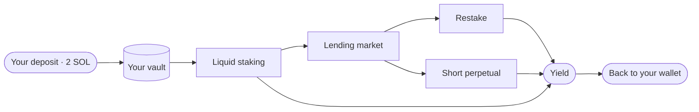

Thaler turns a SOL deposit into a yield position that is delta-neutral, self-custodial, and bounded by a rule set you sign at creation. The protocol guarantees a per-tier yield floor and protects the principal. Realised return above the floor moves with market conditions across three coordinated strategies.

## Read in this order

<Steps>
  <Step title="Understand the product">
    Start with [What is Thaler](/overview/what-is-thaler). One page, plain language, no
    background reading required.
  </Step>
  <Step title="Understand the structure">
    Read [Architecture](/overview/architecture) and [Custody and policy](/overview/custody-and-policy)
    to see how the vault is built and why no party can move your funds without rules you signed.
  </Step>
  <Step title="Understand the strategies">
    Open [Strategies](/strategies/index) and the three pillar pages. Each pillar earns yield
    from a different source so the total return is more stable than any one source on its own.
  </Step>
  <Step title="Understand the operations">
    Walk through [Creating a vault](/vault/create), [Claiming yield](/vault/claim) and
    [Closing a vault](/vault/close). Three operations cover the entire lifecycle.
  </Step>
  <Step title="Understand the guarantees">
    Read [Principal protection](/security/principal-protection), [Yield floor](/security/yield-floor)
    and [Risk disclosure](/security/risk-disclosure) before you deposit.
  </Step>
</Steps>

## What makes Thaler different

<Columns cols={2}>
  <Card title="A yield floor that is guaranteed" icon="shield-check">
    Every tier advertises a minimum return the protocol commits to pay. The floor is derived
    from the worst historical year for that tier with a margin underneath. See
    [Yield floor](/security/yield-floor).
  </Card>
  <Card title="Principal protected by the reserve" icon="vault">
    The protocol holds a SOL reserve that tops up any shortfall on a normal close. The reserve
    is a public Squads vault. See [Principal protection](/security/principal-protection).
  </Card>
  <Card title="Self-custody by default" icon="key">
    Every vault is a Squads smart account you co-sign. The protocol holds the rules, not the
    keys. See [Custody and policy](/overview/custody-and-policy).
  </Card>
  <Card title="A strategy you can verify" icon="binary">
    The Squads policy extension is signed once and enforced on chain. Anyone with a block
    explorer can read the policy and confirm what the vault can and cannot do.
  </Card>
</Columns>

## Beta program

<Note>
  The current beta accepts a fixed deposit of **2 SOL** per vault. The fixed size equalises
  capacity across early users and keeps operational variance low during the first wave.
  Variable deposit sizing opens after the beta closes.
</Note>

The beta is otherwise identical to the production target. Same custody model, same claim mechanics, same closure rules. The protocol does not collect any data during the beta that it will not collect in production.

## Where to next

<Columns cols={3}>
  <Card title="Open the app" icon="arrow-up-right-from-square" href="https://thaler.finance">
    Connect a Solana wallet and create a vault.
  </Card>
  <Card title="Read the strategy pillars" icon="line-chart" href="/strategies/index">
    The three sources of yield and how they coordinate.
  </Card>
  <Card title="Check the FAQ" icon="circle-question" href="/faq">
    Short answers to the most common questions.
  </Card>
</Columns>
