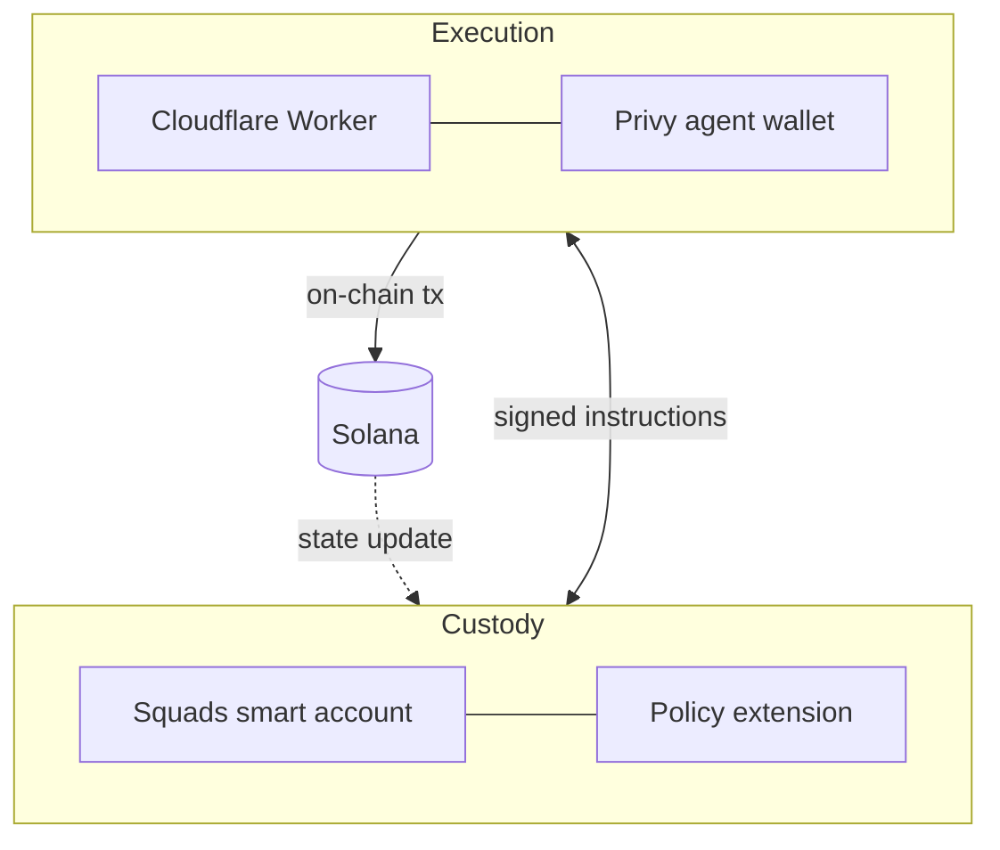

A Thaler vault is composed of four parts. Each part has one responsibility, and the boundaries between them are enforced on chain so no party can bypass them, including the protocol.

## The four parts at a glance

| Component | Role | Held by | Mutable after creation |
|-----------|------|---------|------------------------|
| Squads smart account | Holds the deposit and any yield | User and protocol (multisig) | Account address is permanent |
| Policy extension | Defines what the smart account will sign | User signs once at creation | No |
| Cloudflare Worker | Reads markets and proposes instructions | Protocol operations | Worker can be replaced, policy cannot |
| Privy agent wallet | Co-signs permitted instructions | Protocol | Authority is scoped by the policy |

## How the parts coordinate

<Steps>
  <Step title="The worker reads a market signal">
    A staking yield update, a borrow rate change, a funding rate flip. The worker continuously
    monitors the venues the policy allows.
  </Step>
  <Step title="The worker composes an instruction">
    The instruction targets one of the allowed venues with parameters that fit inside the
    policy's bounds (leverage cap, loan-to-value buffer, allowed asset list).
  </Step>
  <Step title="The agent wallet co-signs">
    The Privy agent wallet adds its signature to the smart account's multisig. If the
    instruction is outside the policy, the smart account refuses it and the transaction
    never reaches the network.
  </Step>
  <Step title="Solana executes the instruction">
    The on-chain program updates the vault's state. Yield accrues, collateral moves, or the
    hedge size changes, depending on which leg was rebalanced.
  </Step>
  <Step title="The protocol records the change">
    The new state shows up in the dashboard, the My Vaults card, and the analytics endpoints.
    No off-chain log is authoritative; the chain is.
  </Step>
</Steps>

## Why this structure

The structure separates four concerns and keeps each one independently reviewable.

<Columns cols={2}>
  <Card title="Custody is separated from rules" icon="vault">
    The smart account holds the funds. The policy holds the rules. The two are linked on chain
    so the funds can only be moved according to the rules.
  </Card>
  <Card title="Rules are separated from execution" icon="route">
    The policy is signed once and never changes. The execution layer can be replaced or
    upgraded without touching the policy.
  </Card>
  <Card title="Execution is separated from signing" icon="signature">
    The worker proposes; the agent wallet signs. The smart account verifies the proposal
    against the policy before either signature counts.
  </Card>
  <Card title="Each layer can be audited alone" icon="microscope">
    Reviewers can inspect the policy extension, the worker, or the agent wallet
    independently. There is no privileged path that lets one bypass another.
  </Card>
</Columns>

## What the user signs

At creation the user signs twice:

1. The **Squads policy extension**. This is the rule set the vault will follow for its entire life. Once signed, it is immutable. Anyone with the smart account address can read the policy on chain.
2. The **Terms and Policy Agreement**. The legal acknowledgement that the user understands the non-discretionary execution model and the residual risks of the underlying venues.

After creation the user signs only for `claim` and `close`. Every other action happens inside the policy bounds.

## How recovery works

Squads smart accounts can be recovered by the user even if the protocol disappears. The deposit and any accrued yield are held by the smart account, not by the protocol. As long as the user holds their share of the multisig, they can interact with the account directly.

The worker is a convenience layer. It can be removed without losing access to the assets it manages. If the worker stops responding, the user can still sign a manual close.

## Next read

<Columns cols={2}>
  <Card title="Custody and policy" icon="key" href="/overview/custody-and-policy">
    Why the policy is immutable, and what the rule set controls.
  </Card>
  <Card title="Strategies" icon="line-chart" href="/strategies/index">
    The three pillars that turn the deposit into yield.
  </Card>
</Columns>
