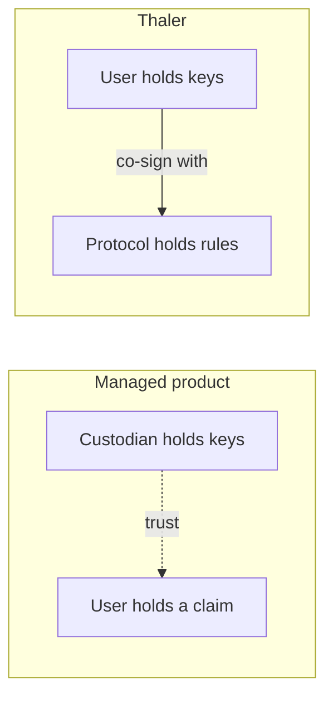

## Self-custodial by construction

A Thaler vault is a Squads smart account. The user is a co-signer on that account from the moment it is created. The protocol cannot move funds out of the vault without the policy explicitly allowing it, and cannot bypass the policy at all.

This is different from a managed product where a custodian holds the keys and the user holds a claim. In Thaler the user holds the keys; the protocol holds the rules.

## What the policy controls

The Squads policy extension binds the vault's behaviour. It defines:

<AccordionGroup>
  <Accordion title="Allowed assets" defaultOpen>
    SOL, the liquid staking tokens the vault may hold, and the stablecoins the borrow leg
    accepts. Tokens outside the list cannot enter or leave the smart account.
  </Accordion>
  <Accordion title="Allowed venues">
    The staking provider, the lending market, the perpetual venue, and any liquidity pool the
    vault may interact with. The smart account refuses interactions with any other program.
  </Accordion>
  <Accordion title="Leverage cap">
    An upper bound on the borrow ratio the lending leg may run. The policy keeps the working
    LTV well below the venue's liquidation threshold.
  </Accordion>
  <Accordion title="Claim cadence">
    The 24-hour cooldown between yield claims. The cooldown is enforced at the smart-account
    level, not the front end.
  </Accordion>
  <Accordion title="Closure procedure">
    How the vault unwinds when the user requests a close, what assets must be returned, and the
    penalty schedule that applies. Closure can only run as a single transaction that matches
    the policy.
  </Accordion>
</AccordionGroup>

Anything outside this list is rejected at the smart-account level.

## Why the policy is immutable

The value of a policy lies in its predictability. A policy that can be amended after signing offers no stronger guarantee than a normal off-chain agreement. Thaler chose immutability so that:

<Columns cols={3}>
  <Card title="Verify once, rely forever" icon="circle-check">
    Read the policy at creation. The same rules are still in force a year later.
  </Card>
  <Card title="Auditable in isolation" icon="microscope">
    Reviewers compare the deployed program to the signed policy without needing to track
    ongoing amendments.
  </Card>
  <Card title="No back-doors under stress" icon="shield">
    The protocol cannot change the rules during a drawdown, an outage, or after a market move.
  </Card>
</Columns>

If the protocol needs to update the rule set, it deploys a new policy version. Existing vaults continue under the policy they signed. Users who want the new version close the existing vault and open a new one.

## Recovery and continuity

Squads smart accounts can be recovered by the user even if the protocol disappears. The deposit and any accrued yield are held by the smart account, not by the protocol. As long as the user holds their share of the multisig, they can interact with the account directly.

This means a Thaler vault is robust to protocol-level events that would normally strand funds. The dedicated worker is a convenience layer; it can be replaced or removed without losing access to the assets it manages.

## How to verify a vault in two minutes

<Steps>
  <Step title="Find your vault address">
    Open the My Vaults screen in the app. The Squads smart account address is shown under the
    vault number.
  </Step>
  <Step title="Open a block explorer">
    Use [Solscan](https://solscan.io) or [Solana Explorer](https://explorer.solana.com).
    Paste the smart account address.
  </Step>
  <Step title="Read the policy extension">
    Under the Squads multisig entry, you will see the attached policy extension. The
    extension lists the allowed programs, the leverage cap, the claim cadence, and the
    closure procedure.
  </Step>
  <Step title="Confirm the strategy matches the policy">
    Compare the on-chain rules to the strategy summary in the app. The two should be exactly
    aligned. If they diverge, do not deposit.
  </Step>
</Steps>

## Next read

<Columns cols={2}>
  <Card title="Strategies" icon="line-chart" href="/strategies/index">
    The three pillars the policy authorises and the venues each one routes through.
  </Card>
  <Card title="Risk disclosure" icon="triangle-exclamation" href="/security/risk-disclosure">
    The residual risks that no on-chain policy can fully eliminate.
  </Card>
</Columns>
