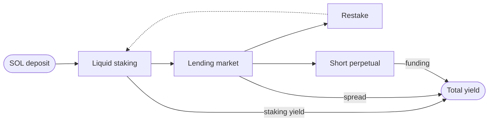
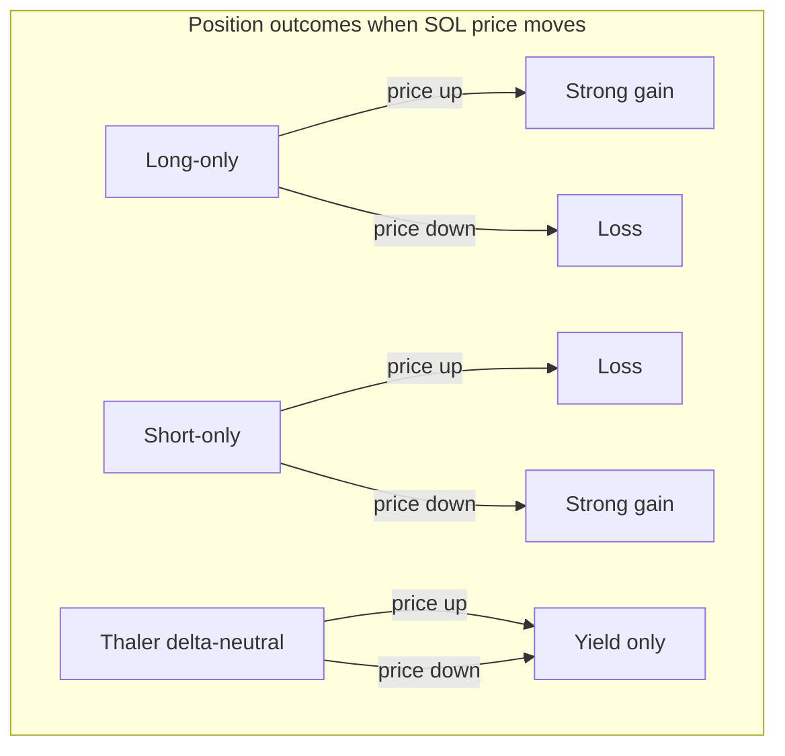

## In one paragraph

Thaler is a Solana yield protocol that builds a delta-neutral position around a SOL deposit. Each user receives a self-custodial vault that allocates capital to three coordinated strategies: liquid staking, a lending loop, and a short perpetual hedge. Realised return comes from staking rewards, the deposit-borrow spread, and the funding rate on the hedge. Because the long staking exposure and the short perpetual exposure cancel out, the vault earns yield without taking a directional view on the price of SOL.

## The shape of the position

The three pillars run in parallel. Each pillar earns yield from a different source, and the same market conditions that compress one source often widen another. The total return is therefore steadier than the sum of any one pillar on its own.

## Who it is for

<Columns cols={2}>
  <Card title="SOL holders who want yield" icon="coins">
    Users with idle SOL who want it to earn without converting to a stablecoin and without
    giving up custody.
  </Card>
  <Card title="Long-duration capital" icon="hourglass">
    Capital that can sit in the vault long enough for the penalty schedule to decay to zero
    (96 days). After that, closing is free.
  </Card>
  <Card title="Audit and integration teams" icon="shield-check">
    Reviewers who need to verify custody, claim cadence, and closure rules before signing off
    on an integration.
  </Card>
  <Card title="Builders" icon="puzzle">
    Teams that want a vault primitive they can route deposits into from a wallet or aggregator.
  </Card>
</Columns>

## Why delta-neutral

A long-only SOL position earns staking and lending yield but is fully exposed to the price of SOL. A short-only position pays or receives funding but is exposed in the opposite direction. Pairing both sides at matching size cancels out the directional exposure and leaves the yield differential.

The chart below illustrates the result in stylised terms. Two positions on the same SOL move, side by side, with the third line showing what Thaler users actually experience.

The user is exposed to the rates earned (staking yield, lending spread, perpetual funding), not the direction of SOL.

## What Thaler is not

<AccordionGroup>
  <Accordion title="Not a discretionary fund">
    The strategy executed by a vault is fixed at creation and enforced on chain. The protocol
    cannot widen the mandate, change the venues, or move assets outside the rules signed by the
    user.
  </Accordion>
  <Accordion title="Not a directional bet on SOL">
    The hedge inside each vault is sized so the value of the vault tracks the yield earned, not
    the price of SOL. Realised return is uncorrelated with SOL spot moves over the holding
    period.
  </Accordion>
  <Accordion title="Not insurance">
    The protocol guarantees the per-tier yield floor advertised at creation and protects deposit
    principal through its reserve. The third-party venues the vault interacts with carry
    residual smart-contract and counterparty risk that no on-chain policy can fully eliminate.
    See [Risk disclosure](/security/risk-disclosure).
  </Accordion>
</AccordionGroup>

## How the beta differs from the production build

The current beta accepts a fixed deposit of 2 SOL per vault. This equalises capacity across early users and keeps operational variance low during the first wave. After the beta closes, deposit sizing becomes variable and the protocol opens additional strategy families beyond Thaler One.

The rest of the product is identical to the production target: same custody model, same claim mechanics, same closure rules. The beta does not collect any data the production build will not collect.

## Next read

<Columns cols={2}>
  <Card title="Architecture" icon="layers" href="/overview/architecture">
    The four components that make up a vault, end to end.
  </Card>
  <Card title="Custody and policy" icon="key" href="/overview/custody-and-policy">
    Who holds the keys to your vault, and why the rules cannot change after signing.
  </Card>
</Columns>
