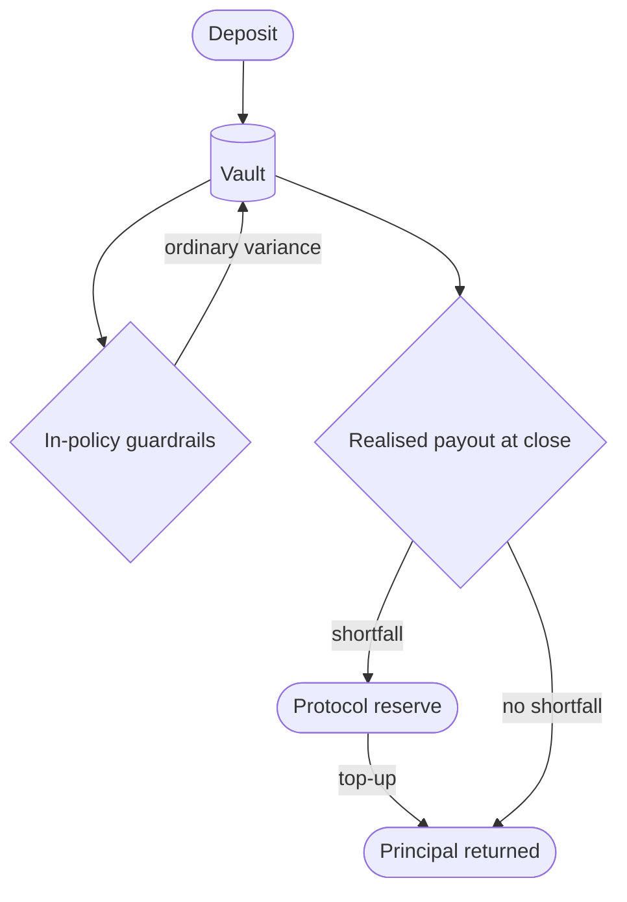

## What is protected

The deposit principal sent to a Thaler vault is protected from loss caused by:

- Adverse moves in the price of SOL during the holding period.
- Funding rate flips on the perpetual hedge that would otherwise erode the position.
- Borrow rate spikes that compress the lending spread to zero or briefly invert it.
- Short-term liquidation pressure inside the policy buffer.

Protection means that, on a normal close, the user receives back at least the SOL amount they deposited, in SOL.

## The two mechanisms

<Steps>
  <Step title="The immutable policy">
    The Squads policy extension constrains the strategy so that the worker cannot put the
    deposit into a position outside the protocol's risk budget. The leverage cap, the
    loan-to-value buffer, the venue allowlist, and the rebalance rules are all encoded in the
    policy. Nothing the worker emits can take the position past those bounds.
  </Step>
  <Step title="The protocol reserve">
    Thaler maintains a protocol reserve denominated in SOL. The reserve sits outside any
    individual vault and is sized to absorb residual variance across the active vault set. When
    a vault produces less than the deposit at close, the reserve tops the payout back to the
    deposit amount.
  </Step>
</Steps>

The two mechanisms operate in series. The policy prevents excursions large enough to consume the reserve in ordinary conditions. The reserve covers the tail where the policy alone is not enough.

## What protection does not cover

Principal protection does not cover:

| Scenario | Why it is excluded |
|----------|--------------------|
| Smart-contract failure of a third-party venue | The protocol cannot underwrite the security of Kamino, the perpetual exchanges, or the liquid staking providers. |
| Loss of user keys | The protocol cannot recover a wallet the user no longer controls. |
| User action outside the protocol | Anything signed by the user with a malicious external application is outside scope. |
| Closure inside the penalty schedule | The penalty is part of the contract the user accepts. Closing after day 96 has no penalty and full protection applies. |

These cases are described in detail under [Risk disclosure](/security/risk-disclosure).

## How to verify the protection

<Steps>
  <Step title="Find your vault address">
    The Squads smart account address is shown under the vault number on the My Vaults screen.
  </Step>
  <Step title="Open a block explorer">
    Paste the address into [Solscan](https://solscan.io) or
    [Solana Explorer](https://explorer.solana.com).
  </Step>
  <Step title="Read the policy extension">
    The policy lists the allowed programs, the leverage cap, the rebalance rules, and the
    closure procedure. The on-chain policy and the strategy summary in the app should agree
    exactly.
  </Step>
  <Step title="Locate the reserve">
    The protocol reserve is a dedicated public Squads vault. Its address is available on
    request via `audit@thaler.finance`. Both inflow and outflow are visible to anyone with a
    block explorer.
  </Step>
</Steps>

## Why protection is meaningful

Many DeFi products advertise high yields with no commitment on the principal. Thaler chose a different posture: the yield is variable but the deposit is anchored. This shifts the question for the user from "can I afford to lose my deposit?" to "do I like the expected yield band?".

The trade-off the protocol makes for this guarantee is built into the reserve sizing and the service fee. Both are calibrated so the protocol can keep the commitment across the full historical record of the supported venues.

## How the reserve is sized

The reserve is sized against the worst observed annual outcome in the V12 walk-forward backtest across the supported venues. The protocol keeps a buffer above the historical worst case so that an outlier year cannot exhaust the reserve. As capacity grows, the reserve grows in step. The protocol publishes the reserve size and the vault count it backs in the analytics endpoints.

## Next read

<Columns cols={2}>
  <Card title="Yield floor" icon="shield-check" href="/security/yield-floor">
    The minimum return commitment that sits on top of the principal protection.
  </Card>
  <Card title="Risk disclosure" icon="triangle-exclamation" href="/security/risk-disclosure">
    The residual risks no on-chain policy can fully eliminate.
  </Card>
</Columns>
