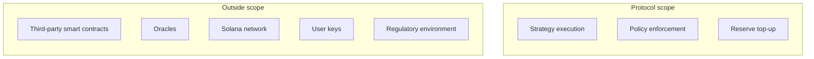

## How to read this page

A Thaler vault is structured to remove as much risk as the protocol can. The Squads policy, the worker, the agent wallet, and the protocol reserve work together to keep the deposit and the yield floor inside well-defined bounds.

That said, the vault interacts with third-party protocols on Solana that are independent of Thaler. These protocols have their own audit trails, their own governance, and their own risk profiles. The following risks remain and are not covered by the principal protection or the yield floor.

## Risk surface at a glance

## Smart-contract risk

The vault routes capital through several external programs:

| Layer | Programs |
|-------|----------|
| Liquid staking | Jito, Marinade |
| Lending | Kamino Lend |
| Perpetual exchange | Hyperliquid, Pacifica |

Each of these is audited and has been live for an extended period. None is perfect. If one of them is exploited and user funds are lost in the venue itself, the loss flows through to the vaults that were holding positions in it at the time. The protocol's reserve is not sized to absorb a full venue failure.

The protocol mitigates this risk by:

- Routing only through venues with multi-year live history and public audit reports.
- Constraining the maximum exposure to any single venue inside the policy.
- Diversifying across at least two venues per strategy leg where possible.

## Oracle risk

Lending markets and perpetual exchanges price collateral and positions from external oracles. If an oracle reports a stale or manipulated price, a liquidation could trigger at an unfavourable level. Venues like Kamino and Hyperliquid use multi-source oracles with circuit breakers; the protocol relies on those circuit breakers and does not run its own.

## Counterparty risk

The perpetual hedge runs against the venue's liquidation engine. In an extreme deleveraging event, the venue can socialise losses across counterparties. The probability is low on the supported venues but is not zero.

## Operational risk

The dedicated Cloudflare Worker can fail to react in time to a fast-moving market. The policy is designed so that worker downtime does not let the position drift into liquidation, but the strategy is less efficient during downtime than during normal operation. Extended downtime can reduce yield without breaching the floor.

## Network risk

Solana itself can experience congestion or outages. During a network outage, transactions cannot be sent and the position cannot be rebalanced. The policy bakes in buffers so that an outage of a few hours does not threaten the position; a longer outage that prevents settlement on close would push the close into the recovery window.

## Regulatory risk

Thaler operates in a regulatory environment that may change. The protocol monitors the jurisdictions of its userbase and reserves the right to restrict access from any jurisdiction where its operations become non-compliant.

## Key management risk

The user retains a key in the vault's Squads multisig. Loss of that key prevents the user from signing closures and claims. The protocol cannot recover lost user keys. Use a wallet you trust and keep a record of its recovery phrase.

## Summary

<Columns cols={2}>
  <Card title="Thaler covers" icon="shield-check">
    The deposit principal on a normal close, plus the per-tier yield floor on a full-year hold
    without a smart-contract failure of an external venue.
  </Card>
  <Card title="Thaler does not cover" icon="triangle-exclamation">
    Smart-contract failure of third-party protocols, oracle manipulation, Solana network
    outages, loss of user keys, regulatory restrictions on the user's jurisdiction.
  </Card>
</Columns>

The user accepts these residual risks as part of the Terms and Policy Agreement signed at creation. The agreement is reproduced in the Create Vault flow and must be scrolled to the bottom and ticked before signing.

## Next read

<Columns cols={2}>
  <Card title="Principal protection" icon="vault" href="/security/principal-protection">
    What Thaler does cover, in detail, and how to verify the reserve that backs the commitment.
  </Card>
  <Card title="FAQ" icon="circle-question" href="/faq">
    Short answers to the most common questions about Thaler.
  </Card>
</Columns>
