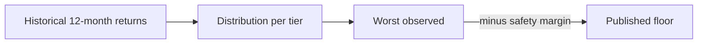
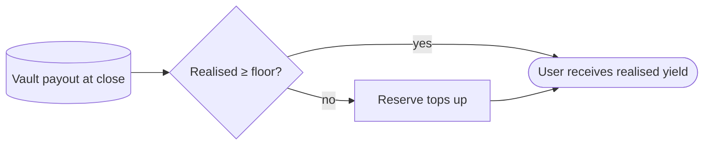

## What the yield floor is

Each Thaler tier advertises a **yield floor** alongside its APY range. The floor is the minimum realised return the protocol commits to pay on a full-year hold of the vault.

The yield floor is shown:

- Next to the APY range on the Strategies page.
- On every tier card in the Create Vault selector.
- Under the strategy summary on the My Vaults dashboard.

| Tier | Yield floor (net of service fee) |
|------|----------------------------------|
| Safe | 7.0 % |
| Conservative | 7.1 % |
| Balanced | 7.3 % |
| Optimistic | 7.5 % |
| Aggressive | 7.8 % |
| YOLO | 8.1 % |

Higher-tier vaults run at higher leverage on the hedge and carry more variance, but the floor moves up with the tier so the commitment stays meaningful at every level.

## How the floor is derived

The protocol does not pick the floor arbitrarily. It is derived from the V12 walk-forward backtest of the strategy across the full live history of the supported venues.

<Steps>
  <Step title="Run the strategy over every 12-month window">
    For each tier, simulate the realised payout assuming the user closes after a full year.
  </Step>
  <Step title="Collect the end-of-window returns">
    Build a distribution of realised returns across every starting date in the dataset.
  </Step>
  <Step title="Take the worst observed return">
    The lowest realised return in the distribution sets the upper bound of the floor.
  </Step>
  <Step title="Apply a safety margin">
    The floor is set below the worst observed return so a year that is slightly worse than any
    historical year is still inside the commitment.
  </Step>
</Steps>

The floor is not a forward projection. It is a backward-derived commitment, designed to hold even if the next year is worse than any past year on record.

## How the floor is paid

When a vault closes and the realised return is below the floor, the protocol reserve covers the gap. The user receives at least the floor amount, net of the service fee.

If the realised return exceeds the floor, the user receives the realised return. The floor is a floor, not a ceiling. Nothing about the yield floor caps the upside.

## What can break the floor

Two scenarios are explicitly outside the floor:

- **Smart-contract failure of a third-party venue.** If a venue loses funds outside the
  protocol's control, the floor does not apply to that loss. This is the residual risk
  described in [Risk disclosure](/security/risk-disclosure).
- **A close inside the penalty schedule.** Closing before day 96 incurs a fee that is deducted
  from the payout. The fee can reduce the SOL amount below the deposit even if the gross
  realised yield was at the floor. After day 96, the penalty is zero and the floor applies in
  full.

## Why a floor and not a fixed APY

A fixed APY would imply the protocol can guarantee the exact return regardless of market conditions. That would require either:

- Stripping the variable upside (the user gets exactly the fixed rate even when conditions are
  excellent), or
- Promising more than the protocol can sustainably deliver.

A floor preserves the variable upside the strategy actually produces and commits the protocol to a tested lower bound. Users participate in the realised yield above the floor and are protected below it.

## How the floor relates to principal protection

[Principal protection](/security/principal-protection) and the yield floor are separate commitments. Principal protection ensures you receive at least the deposit back. The yield floor ensures you receive at least the floor return on top of the deposit.

| Outcome | Principal protection | Yield floor | Total payout |
|---------|---------------------|-------------|--------------|
| Best case | Active | Active | Deposit + realised yield above floor |
| Median case | Active | Active | Deposit + realised yield (above floor) |
| Worst supported case | Active | Active | Deposit + floor |
| Smart-contract failure | Not covered | Not covered | Partial recovery only |

In the worst supported case, the user receives `deposit + floor`. In the best case, the user receives `deposit + realised yield` where realised yield is the strategy's actual performance.

## Next read

<Columns cols={2}>
  <Card title="Principal protection" icon="vault" href="/security/principal-protection">
    The deposit-side guarantee that pairs with the yield floor.
  </Card>
  <Card title="Risk disclosure" icon="triangle-exclamation" href="/security/risk-disclosure">
    The residual risks that neither protection nor the floor covers.
  </Card>
</Columns>
