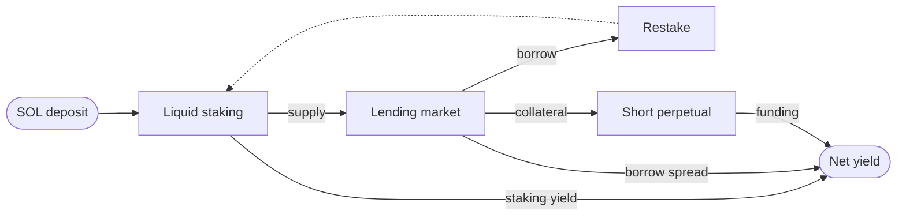
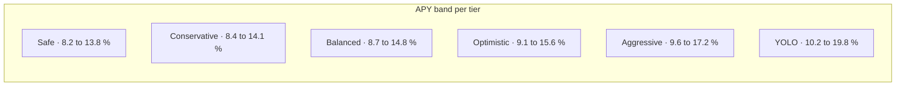

A Thaler vault runs three pillars in parallel. Each pillar earns from a different rate, and the same market conditions that compress one rate often widen another. The total return is steadier than any one pillar alone.

## The three pillars

<Columns cols={3}>
  <Card title="Liquid staking" icon="layers" href="/strategies/liquid-staking">
    SOL is staked through a liquid staking provider. The deposit keeps earning the network's
    staking reward while it is also used by the other two legs.
  </Card>
  <Card title="Lending markets" icon="banknote" href="/strategies/lending-markets">
    The liquid staking token is supplied as collateral on a lending market. The vault borrows
    SOL against it and restakes a part of the borrowed SOL into the same token, capturing the
    deposit-borrow spread.
  </Card>
  <Card title="Perpetual markets" icon="scale" href="/strategies/perpetual-markets">
    A short perpetual position offsets the directional exposure that comes from holding SOL.
    The funding rate received on the short adds to the total return.
  </Card>
</Columns>

## How the pillars combine

The three rates accrue independently. When funding is positive, the perpetual leg dominates the return. When borrow rates compress, the lending leg dominates. When SOL inflation is high, the staking leg dominates. The vault never depends on any one pillar to deliver the yield floor.

## Strategy families

Thaler ships strategies in families. The first family is **Thaler One**, which offers six tiers from `Safe` to `YOLO`. Every tier uses the same three pillars; the difference is the weight assigned to each.

<AccordionGroup>
  <Accordion title="Safe">
    The largest share of capital sits in liquid staking. The lending leg runs at the lowest
    leverage in the family. The hedge is sized only to keep the position market neutral, not to
    extract funding income.
  </Accordion>
  <Accordion title="Conservative">
    A small shift toward the lending leg. The hedge stays at the same low leverage as Safe.
    Returns track the deposit-borrow spread on Kamino more closely than they do on Safe.
  </Accordion>
  <Accordion title="Balanced">
    Roughly even weight between the lending leg and the hedge. The hedge runs at moderate
    leverage so funding income contributes alongside the lending carry.
  </Accordion>
  <Accordion title="Optimistic">
    A larger hedge with the same moderate leverage as Balanced. Returns are biased toward
    funding income.
  </Accordion>
  <Accordion title="Aggressive">
    The hedge runs at higher leverage. Funding becomes the dominant source of yield.
    Rebalances happen more frequently to keep the position market neutral as size grows.
  </Accordion>
  <Accordion title="YOLO">
    The hedge runs at the highest leverage the protocol allows. Returns are the most variable
    in the family and the most sensitive to funding-rate regimes.
  </Accordion>
</AccordionGroup>

## APY band by tier

Each tier ships with a published APY band and a guaranteed yield floor.

| Tier | APY band | Yield floor |
|------|----------|-------------|
| Safe | 8.2 % to 13.8 % | 7.0 % |
| Conservative | 8.4 % to 14.1 % | 7.1 % |
| Balanced | 8.7 % to 14.8 % | 7.3 % |
| Optimistic | 9.1 % to 15.6 % | 7.5 % |
| Aggressive | 9.6 % to 17.2 % | 7.8 % |
| YOLO | 10.2 % to 19.8 % | 8.1 % |

The yield floor is the minimum return the protocol commits to pay on a full-year hold. It is honoured by the protocol reserve, not by a venue. See [Yield floor](/security/yield-floor) for the full mechanism.

Exact weights, leverage values, and rebalancing thresholds are not published here. They are part of the strategy signature and would lose value if disclosed in full. Reviewers with a legitimate need to inspect them can request the audited specification under NDA at `audit@thaler.finance`.

## Why three pillars instead of one

A single-pillar strategy is exposed to one source of variance: either the staking yield, the borrow spread, or the funding rate. When that source moves the wrong way, the whole position is exposed.

A three-pillar strategy spreads exposure across uncorrelated rates. Periods where one pillar underperforms are usually periods where another pillar outperforms, because the same conditions drive them in opposite directions. The result is a flatter distribution of realised returns and a higher probability of clearing the yield floor in any given year.

## What is identical across tiers

Every tier shares the same:

- Custody model (self-custodial Squads smart account)
- Claim cadence (24-hour cooldown between claims)
- Closure rules and penalty schedule
- Principal protection commitment ([Principal protection](/security/principal-protection))
- Yield floor guarantee ([Yield floor](/security/yield-floor))

Only the strategy parameters and the resulting return profile differ.

## Next read

<Columns cols={2}>
  <Card title="Liquid staking" icon="layers" href="/strategies/liquid-staking">
    The base of every vault and the source of the floor yield.
  </Card>
  <Card title="Lending markets" icon="banknote" href="/strategies/lending-markets">
    The carry loop that runs on Kamino today and routes to Jupiter Lend and MarginFi next.
  </Card>
  <Card title="Perpetual markets" icon="scale" href="/strategies/perpetual-markets">
    The hedge leg on Hyperliquid and Pacifica, with funding income as the upside.
  </Card>
  <Card title="Yield floor" icon="shield-check" href="/security/yield-floor">
    How the floor is set, how it is paid, and what backs the commitment.
  </Card>
</Columns>
