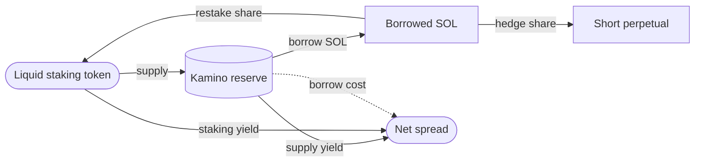
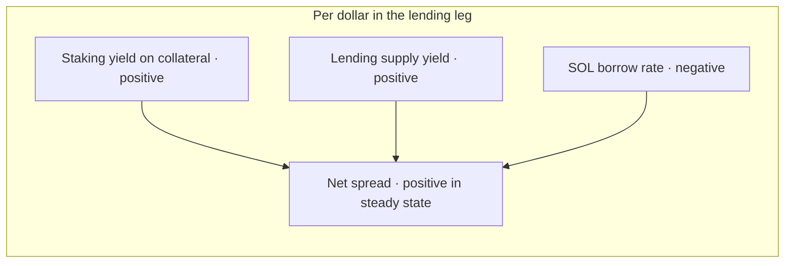

## What this leg does

After the staking leg, the vault holds a liquid staking token (jitoSOL or mSOL). The lending leg supplies that token as collateral on a lending market and borrows SOL against it. A portion of the borrowed SOL is restaked into the same liquid staking token; the remainder funds the perpetual hedge.

The result is a position that earns three rates simultaneously:

1. **Staking yield** on the supplied liquid staking token.
2. **Lending yield** on the supplied collateral, paid by other borrowers on the market.
3. The **negative of the borrow rate** on the SOL drawn against it.

The first two are paid to the vault. The third is paid by the vault. When the sum is positive, the leg adds yield. The protocol selects markets and configurations where the sum has been positive across the historical record.

## Supported markets

The lending leg currently runs on **Kamino Lend**. Kamino is a Solana lending market with on-chain liquidity, public reserves, and well-documented liquidation parameters. The vault uses Kamino because:

- It accepts jitoSOL and mSOL as supply collateral with reasonable loan-to-value caps.
- Its borrow rate model is curve-based and updates continuously with utilisation, which makes the spread predictable.
- It exposes a programmatic interface that the worker can use without manual intervention.

Additional lending markets are queued for the next release.

| Market | Status |
|--------|--------|
| Kamino Lend | Live |
| Jupiter Lend | Coming next |
| MarginFi | Coming next |

When the next markets come online, vaults will route to whichever venue offers the best risk-adjusted spread at the moment of execution, subject to the constraints in the policy.

## Loan-to-value and liquidation buffers

The vault never operates at the maximum loan-to-value the market permits. The policy bakes in a buffer between the working LTV and the liquidation threshold so that ordinary market moves do not trigger a forced unwind. The size of the buffer is chosen so that:

- Routine volatility does not bring the position close to liquidation.
- A large adverse move triggers a rebalance, not a liquidation.
- The worker has time to act before any external party can step in.

The exact buffer and rebalance thresholds are part of the policy extension and visible on chain once a vault is created. They are not published in aggregate here because they would compose into the strategy signature.

## Why the spread is usually positive

Lending markets price borrow rates above supply rates. The vault is on both sides of the same market: it supplies a liquid staking token (earning supply yield plus the underlying staking yield) and borrows SOL (paying the SOL borrow rate). Across history, the supply yield plus the staking yield on the collateral has exceeded the borrow rate on SOL by a workable margin on Kamino.

When the spread compresses or inverts, the worker reduces the size of the lending leg. When it widens, the worker can extend the leg back to its normal range. The decision is made within the policy bounds; nothing the worker does can move the leg outside them.

## How the worker reacts to rate changes

| Event | Worker response |
|-------|------------------|
| Borrow rate rises above the configured threshold | Reduce the lending leg, increase the hedge weight |
| Supply yield drops on Kamino | Reduce the leg until the spread is positive again |
| LTV approaches the buffer line | Rebalance by repaying borrow before liquidation can be triggered |
| Liquid staking token discount widens | Pause new borrows, hold existing position, route the next vault to the other LST |

Every response is bounded by the policy extension. There is no override path.

## Next read

<Columns cols={2}>
  <Card title="Perpetual markets" icon="scale" href="/strategies/perpetual-markets">
    The hedge leg that pairs with the long SOL exposure introduced here.
  </Card>
  <Card title="Custody and policy" icon="key" href="/overview/custody-and-policy">
    How the LTV buffer, leverage cap, and rebalance thresholds live inside the policy extension.
  </Card>
</Columns>
