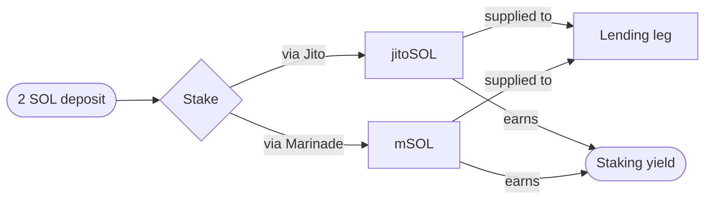
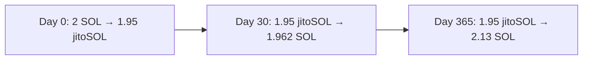

## The role of staking

Every Thaler vault rests on a liquid staking position. When you deposit SOL, the protocol mints (or buys) a liquid staking token on your behalf. The token represents staked SOL plus the staking rewards that accrue over time. While the rest of the vault uses the token in other ways, the staking yield keeps accruing in the background and forms the floor of the total return.

## Supported assets

The protocol currently supports the following liquid staking tokens as the staking leg of a vault.

| Token | Issuer | Status |
|-------|--------|--------|
| jitoSOL | Jito | Live |
| mSOL | Marinade | Live |
| bSOL | BlazeStake (Solana Blaze) | Coming next |
| STKESOL | Sol Strategies | Coming next |

Each vault stakes through one token, chosen at creation. The choice is locked into the policy extension and cannot be changed afterwards. Closing the vault unwinds the staking position and returns SOL to the user.

## Why liquid staking matters

Plain SOL staking locks the token inside a stake account. The reward is paid in SOL but the principal cannot be used elsewhere. Liquid staking tokens are tradable and composable, which means the vault can:

- Supply the token as collateral on a lending market.
- Provide the token into a liquidity pool when the strategy calls for it.
- Settle the token back to SOL immediately when the vault closes.

Without liquid staking, the three-pillar design would not be possible. The lending and perpetual legs depend on a yield-bearing token that the vault can move around without losing the staking reward.

## Staking provider risk

The staking leg inherits the operational track record of the chosen provider. Jito and Marinade have multi-year live records on Solana, large amounts of SOL staked through them, and published audits of their stake distribution and validator selection logic. Their smart contracts are independent of Thaler.

The protocol does not run its own validator set. If a provider's contracts fail or its validators are slashed, the vault is exposed to that loss. See [Risk disclosure](/security/risk-disclosure) for the full picture.

## How rewards are realised

Staking rewards are paid into the liquid staking token's exchange rate. As rewards accrue, the token becomes worth slightly more SOL than it did at issuance. When the vault closes, the user receives the SOL equivalent of the token at the prevailing exchange rate, capturing the accrued staking yield in the same payout.

The protocol does not distribute staking rewards separately. They are part of the total return paid at close, alongside the lending spread and the perpetual funding.

## Why two providers and not one

A single staking provider is a single point of failure. Even strong providers can experience operational events that compress their rewards or temporarily lock redemption. Routing through two providers, both with deep track records and overlapping validator footprints, lets the protocol step away from a degraded provider without selling at a loss.

In practice the choice between jitoSOL and mSOL is rarely material to the user's realised return. The two tokens track each other within a few basis points over typical holding periods. The optionality matters most during stress, when one provider's discount widens and the protocol can route the next vault to the other.

## Next read

<Columns cols={2}>
  <Card title="Lending markets" icon="banknote" href="/strategies/lending-markets">
    How the staking token is supplied as collateral and the loop that captures the spread.
  </Card>
  <Card title="Perpetual markets" icon="scale" href="/strategies/perpetual-markets">
    The short side that pairs with the long staking exposure to keep the vault market neutral.
  </Card>
</Columns>
