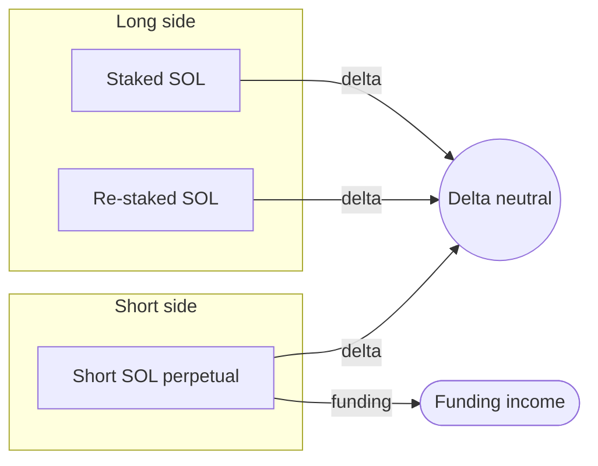
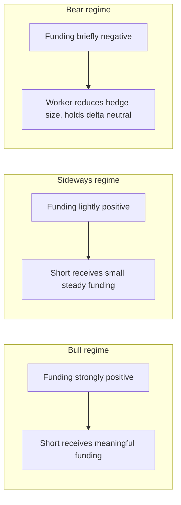

## What this leg does

The lending leg leaves the vault long SOL exposure: it holds staked SOL and re-staked SOL, so the value of the position rises and falls with the price of SOL. To make the vault delta neutral, a short perpetual position is opened in equal size.

When the price of SOL moves, the long staking exposure and the short perpetual exposure move in opposite directions. The two cancel out, and the user's payout reflects the yield earned rather than the price action.

The short position also receives a funding rate when funding is positive. Historically, SOL perpetuals have spent most of their time in positive funding, so the hedge adds a third source of yield on top of staking and the lending spread.

## Supported venues

The hedge leg currently runs on **Hyperliquid** or **Pacifica**, selected per vault.

| Venue | Status |
|-------|--------|
| Hyperliquid | Live |
| Pacifica | Live |
| Phoenix | Coming next |
| Bullet | Coming next |
| Bulk | Coming next |

The selection is part of the policy extension and is locked at creation. The protocol chose Hyperliquid and Pacifica because they:

- Publish funding rates in real time with a verifiable history.
- Support SOL-USDC perpetuals with deep liquidity.
- Expose a programmatic interface usable by the worker without manual intervention.

When the next venues come online, vaults will route to whichever offers the best risk-adjusted funding profile at the moment of execution, subject to policy constraints.

## Why a perpetual instead of a future-dated short

A perpetual position never expires. It can be held for the lifetime of the vault without a roll, and its funding rate adjusts continuously to track the spot-futures basis. A future-dated short would require periodic rolls, each of which introduces slippage and a small operational risk window.

Perpetuals also pay or receive funding every funding period, which lets the funding income compound rather than accumulate to a single settlement.

## Funding income by regime

In bull regimes the long side is paying perpetual longs more than usual, so the short side (which the vault is on) earns more. In bear regimes funding can flip negative for short periods, at which point the worker reduces the hedge size until the funding regime turns positive again.

## Leverage on the hedge

The hedge leg uses leverage. The leverage is bounded by the policy extension and is chosen so that:

- A reasonable margin buffer protects against intra-day volatility.
- The vault never operates within a margin-call distance of the venue's auto-deleveraging band.
- Funding income is meaningful at the scale of the deposit.

Higher leverage in the hedge is the main difference between the `Safe` and `YOLO` tiers of Thaler One. Higher leverage means a larger share of the realised yield comes from funding, and a larger share of the variance comes from funding regime changes. Lower leverage means the staking and lending pillars dominate the return.

| Tier | Funding contribution (typical) |
|------|--------------------------------|
| Safe | Smallest |
| Conservative | Small |
| Balanced | Roughly even with carry |
| Optimistic | Larger |
| Aggressive | Dominant |
| YOLO | Dominant and most variable |

## What happens when funding flips negative

If funding turns negative, the short pays rather than receives. The worker has two levers:

1. **Reduce the hedge size** so the negative funding bill shrinks. This trades hedge precision for lower funding cost.
2. **Rebalance more frequently** so the position spends less time on the wrong side of the funding curve.

Both moves are bounded by the policy. The vault never closes the hedge entirely while a lending leg is open, because that would leave the position directionally exposed.

## Next read

<Columns cols={2}>
  <Card title="Custody and policy" icon="key" href="/overview/custody-and-policy">
    Where the leverage cap and the rebalance rules live, and why they cannot change once
    signed.
  </Card>
  <Card title="Yield floor" icon="shield-check" href="/security/yield-floor">
    What backs the per-tier floor when funding regimes turn against the hedge.
  </Card>
</Columns>
