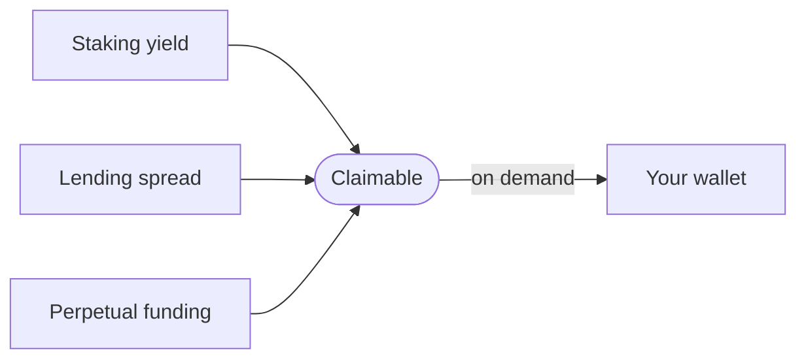
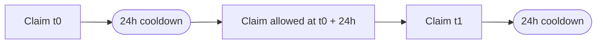

## How yield accrues

Yield is paid into the vault continuously. It does not sit in a separate account waiting to be distributed. It accumulates as a higher liquid staking token balance, a wider lending spread, and funding payments on the perpetual hedge.

When you read the **Claimable** value on the dashboard or on the My Vaults screen, you are reading the protocol's best estimate of the unrealised yield that can be settled to your wallet right now.

## The claim operation

The claim operation settles part of the accrued yield to your wallet without closing the vault. It does not unwind any of the three pillars; the position keeps running afterwards. A claim is a small operation compared to a close.

<Steps>
  <Step title="Open the My Vaults screen">
    Each vault card shows the current claimable amount on the right side.
  </Step>
  <Step title="Click Claim">
    The button is disabled when the vault is inside its 24-hour cooldown window.
  </Step>
  <Step title="Approve the transaction">
    A single wallet signature is required. The protocol does not need any other authorisation.
  </Step>
  <Step title="Yield lands in your wallet">
    Most claims settle in under a minute. The vault keeps running and accumulating new yield.
  </Step>
</Steps>

The claim is settled in the staking token of the leg that produced the yield. Most vaults pay in jitoSOL or mSOL; some pay in SOL when the perpetual funding side dominates the realised amount.

## The 24-hour cooldown

Each vault has a 24-hour cooldown between claims. The cooldown starts when a claim transaction confirms; once 24 hours have passed, the vault is eligible to claim again.

The cooldown exists for two reasons:

1. **Operational cost.** Each claim sends an on-chain transaction. Spamming claims would burn network fees against small yield amounts, lowering the user's effective rate.
2. **Stable accrual measurement.** A vault that is claimed every block produces noisy accounting. A 24-hour minimum window gives a clean realised-yield figure across periods.

The cooldown is enforced by the policy extension, not by the front end. The smart account refuses the claim instruction inside the cooldown window even if the front end allows you to send it.

## What the claim does not do

A claim:

- Does **not** close the vault. The strategy continues running.
- Does **not** reset the penalty schedule. The penalty applies only to closure; claims are independent.
- Does **not** affect the deposit. The original 2 SOL is unchanged.
- Does **not** require a counter-party. Yield is settled from the vault's own balance.

## When to claim, when to wait

Most users either:

- Claim opportunistically when the cooldown allows and the claimable amount is large enough to justify the network fee.
- Wait until they close the vault. The closure settles all accrued yield in one transaction without a separate claim.

Both choices are legitimate. Claiming neither helps nor harms the strategy. It only changes when yield moves from the vault to the wallet.

## Worked example

A vault opened with 2 SOL on the Balanced tier (11.75 % median APY). After 30 days the median realised return is around 0.92 % of the deposit, so roughly 0.018 SOL has accumulated as claimable yield.

| Day | Action | Claimable before | Claimable after |
|-----|--------|------------------|-----------------|
| 30 | Claim | 0.018 SOL | 0 |
| 31 | (cooldown) | new yield only | new yield only |
| 55 | Claim | ~0.014 SOL | 0 |
| 90 | Close | full balance settles in close | n/a |

Claims throughout the life of the vault are independent of the closure penalty schedule.

## Next read

<Columns cols={2}>
  <Card title="Closing a vault" icon="vault" href="/vault/close">
    The final settlement that returns the deposit plus all accumulated yield in SOL.
  </Card>
  <Card title="Fees" icon="receipt" href="/vault/fees">
    The 11 % service fee on realised yield and the closure penalty schedule.
  </Card>
</Columns>
