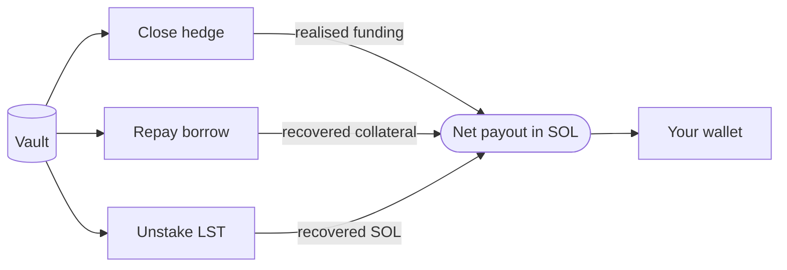

## What the close operation does

Closing a vault settles all three pillars and returns the deposit plus accumulated yield to the user's wallet, denominated in SOL. The close runs in one transaction.

<Steps>
  <Step title="Close the perpetual hedge">
    Position is unwound on the configured venue and any realised funding is booked.
  </Step>
  <Step title="Repay the borrow leg">
    Borrowed SOL is returned to Kamino and the supplied liquid staking collateral is
    recovered.
  </Step>
  <Step title="Unstake the LST">
    The recovered liquid staking token is converted back to SOL through the staking provider
    or a same-chain swap.
  </Step>
  <Step title="Pay out to your wallet">
    The net SOL amount is settled to the user's wallet. No further action is needed.
  </Step>
</Steps>

## The 96-day penalty schedule

A vault closed before day 96 incurs a closure fee. The fee starts at 3 % of the deposit on day 0 and decays linearly to 0 % at day 96. After day 96, a close is free.

The penalty exists because the strategy is most efficient when capital can be held long enough to ride out short-term variance in funding rates and lending spreads. A very short hold can leave the vault on the wrong side of a funding regime change, and the protocol reserves a buffer to smooth that case.

The penalty is paid from the vault's balance at the moment of closure. It is not added separately. The SOL the user receives is already net of the fee.

## Penalty by closure day

| Day closed | Penalty rate | Penalty on a 2 SOL deposit |
|------------|--------------|----------------------------|
| 0 | 3.000 % | 0.0600 SOL |
| 7 | 2.781 % | 0.0556 SOL |
| 30 | 2.063 % | 0.0413 SOL |
| 60 | 1.125 % | 0.0225 SOL |
| 90 | 0.188 % | 0.0038 SOL |
| 96+ | 0.000 % | 0.0000 SOL |

## When closing makes sense

Close when:

- You want to withdraw the deposit. There is no other way to exit.
- The vault is past day 96 and the penalty is zero.
- The penalty schedule has decayed to a level you are comfortable paying.

Close is not the right action when you only want to collect yield. Use the [claim operation](/vault/claim) instead.

## What you receive

The payout is denominated in SOL. The amount equals:

- The deposit, minus any closure penalty that applies on that day,
- Plus the accumulated unclaimed yield from all three pillars,
- Net of network fees for the close transaction.

If any claim was made during the vault's life, the already-claimed amount sits in your wallet from those earlier transactions; the close only pays what is left.

## What happens behind the scenes

The close is enforced by the policy extension. The Cloudflare Worker can propose a close, but the smart account checks that the proposed instructions match the closure procedure baked into the policy: same unwind order, same venue interactions, same payout address. If the proposed close deviates, the smart account refuses the transaction.

This means a close always returns funds to the user's wallet. There is no path inside the policy that lets the worker route the payout elsewhere.

## Next read

<Columns cols={2}>
  <Card title="Fees" icon="receipt" href="/vault/fees">
    The service fee that applies to realised yield, plus the creation fee and the closure
    penalty in detail.
  </Card>
  <Card title="Principal protection" icon="vault" href="/security/principal-protection">
    The reserve that tops up the deposit on a normal close if realised yield falls short.
  </Card>
</Columns>
