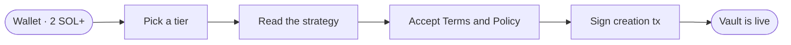
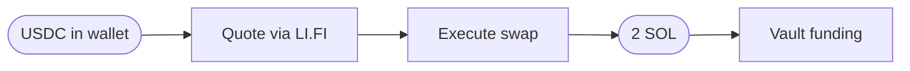

## Before you start

You need:

- A Solana wallet with at least **2 SOL** plus a small amount for network fees.
- A connected Solana RPC. The protocol uses a public RPC by default; you can configure a custom one in settings if you prefer.

## The flow at a glance

## Walk through

<Steps>
  <Step title="Open the app">
    Navigate to `thaler.finance` and sign in with your Solana wallet. The protocol uses
    self-custodial sign-in: nothing leaves your wallet until you approve a transaction.
  </Step>
  <Step title="Choose a tier">
    Open the **Create Vault** screen and select one of the six Thaler One tiers. The selector
    shows the APY range, the yield floor, and the minimum deposit for each tier. The minimum is
    fixed at 2 SOL for the beta.
  </Step>
  <Step title="Review the strategy">
    Read the strategy summary on the left side of the screen. It shows the three pillars the
    vault will use, the venues it will route through, and the immutable constraints baked into
    the policy.
  </Step>
  <Step title="Read the Terms and Policy Agreement">
    The acceptance modal opens when you click **Create Vault**. Scroll to the bottom of the
    agreement and tick the acceptance box. The agreement covers the non-discretionary execution
    model, the Cloudflare Worker that runs the strategy, the Privy agent wallet that co-signs
    permitted instructions, and the immutable Squads policy extension.
  </Step>
  <Step title="Sign the creation transaction">
    Approve the transaction in your wallet. The transaction creates the smart account, signs
    the policy extension, takes the vault creation fee, and routes the deposit into the staking
    leg.
  </Step>
  <Step title="Wait for confirmation">
    Most vaults confirm in under thirty seconds. After confirmation the vault appears on the
    **My Vaults** screen and the worker begins building the three pillars within the policy
    bounds.
  </Step>
</Steps>

## What you sign at creation

The creation transaction bundles four actions into a single signature:

| Action | Effect |
|--------|--------|
| Create the Squads smart account | A new on-chain account with you as a co-signer |
| Co-sign the policy extension | The rule set is bound to the account and becomes immutable |
| Take the vault creation fee | A small SOL amount goes to the protocol treasury |
| Route the deposit into the staking leg | 2 SOL is staked through the chosen provider |

No additional signature is required to start the lending and perpetual legs. The worker builds them inside the policy bounds you just signed.

## Fixed deposit size

The beta accepts exactly **2 SOL** per vault. The amount input is locked so it cannot be set higher or lower. This applies whether you choose SOL or USDC as the deposit token; the USDC equivalent is routed to SOL using a same-chain LI.FI swap before the vault is funded.

The fixed deposit makes capacity comparable across early users and removes one variable from the operational picture during the first wave. Variable deposit sizing opens after the beta concludes.

## Depositing in USDC

If you select USDC as the deposit token, the protocol routes through LI.FI to swap the USDC into the SOL equivalent of 2 SOL. The deposit form shows the route, the estimated USDC required, and the chosen aggregator before you sign.

The swap happens in the same transaction as the deposit, so a partial fill never strands the funds.

## What you do not need to do

You do not need to:

- Pick the staking provider for each leg. The vault makes that choice based on the policy and current conditions.
- Decide between Kamino and the upcoming lending venues. The vault routes within the policy.
- Configure rebalancing rules. They are part of the policy and immutable.
- Set a stop loss or a take profit. The strategy is non-discretionary; the policy already defines the boundaries.

The only choices the user makes at creation are the tier and the deposit token.

## Next read

<Columns cols={2}>
  <Card title="Claiming yield" icon="coins" href="/vault/claim">
    How accrued yield is settled to your wallet, and the 24-hour cooldown that gates the claim
    button.
  </Card>
  <Card title="Closing a vault" icon="vault" href="/vault/close">
    The single-transaction unwind that returns the deposit plus accumulated yield in SOL.
  </Card>
</Columns>
