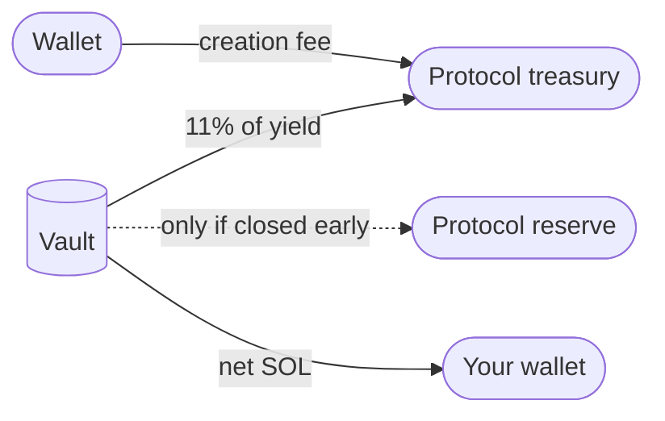

## What you pay

A Thaler vault has three fees over its lifetime. They are all transparent and all settled on chain.

| Fee | Rate | When collected | Paid from |
|-----|------|----------------|-----------|
| Vault creation fee | Small fixed SOL amount | At creation | Wallet balance |
| Service fee | 11 % of realised yield | At each claim and at close | Harvested yield |
| Closure penalty | 3 % decaying to 0 % over 96 days | Only on closure before day 96 | Vault balance |

## The three fees in detail

<AccordionGroup>
  <Accordion title="Vault creation fee" defaultOpen>
    A small fixed fee paid at creation. It is denominated in SOL and is set so that creating a
    vault does not require any other configuration. The current value is shown on the Create
    Vault screen before you confirm the transaction.
  </Accordion>
  <Accordion title="Service fee">
    A flat 11 % of the realised yield, collected at claim time and at close time. The protocol
    never takes a share of the deposit. If the vault produced no yield, the service fee is
    zero.
  </Accordion>
  <Accordion title="Closure penalty">
    A fee that starts at 3 % of the deposit on day 0 and decays linearly to 0 % by day 96. If
    you close after day 96 there is no penalty. The schedule is enforced by the immutable
    policy and cannot be waived by the protocol.
  </Accordion>
</AccordionGroup>

## What you do not pay

- **No deposit fee.** The full deposit enters the vault.
- **No management fee.** The service fee is performance-based; if the vault earns nothing, the
  protocol earns nothing.
- **No withdrawal fee outside the penalty schedule.** Closing after day 96 is free.

## Network fees

The transactions that the worker emits on your vault's behalf pay Solana network fees. These are paid out of the vault's balance, not by the user, and are typically a few cents per transaction. They are not a Thaler fee; they are a Solana network cost.

## Net APY versus gross APY

The headline APY shown for each tier on the Strategies and Create Vault screens is the **net** APY. It already deducts the service fee from the gross strategy return.

You do not need to subtract anything to compare across tiers. The yield floor advertised next to each tier is also a net number. The protocol guarantees that the floor will be paid, after the service fee is taken.

## A worked example

A vault deposited at 2 SOL on the Balanced tier (median net APY 11.75 %, yield floor 7.3 %).

After one year of running uninterrupted, the vault closes:

- Median case: vault pays out `2 × 1.1175 = 2.235 SOL` (or more, depending on realised conditions).
- Worst case: vault pays out at least `2 × 1.073 = 2.146 SOL` (the yield floor).
- Best case: vault pays out up to `2 × 1.148 = 2.296 SOL` (the upper band).

If the vault is closed before day 96, the closure penalty is deducted from the final amount.

Closing on day 30, for example, with a median realised yield of 0.92 % so far:

| Item | Value |
|------|-------|
| Deposit | 2.000 SOL |
| Realised yield (gross) | 0.0207 SOL |
| Service fee (11 %) | 0.0023 SOL |
| Realised yield (net) | 0.0184 SOL |
| Closure penalty (day 30, 2.063 %) | 0.0413 SOL |
| **Payout** | **1.977 SOL** |

The closure penalty is the dominant cost in this example. Holding to day 96 would have avoided it entirely.

## Next read

<Columns cols={2}>
  <Card title="Yield floor" icon="shield-check" href="/security/yield-floor">
    The minimum return commitment after the service fee is taken.
  </Card>
  <Card title="Principal protection" icon="vault" href="/security/principal-protection">
    What backs the principal on a normal close, and what the protection does not cover.
  </Card>
</Columns>
